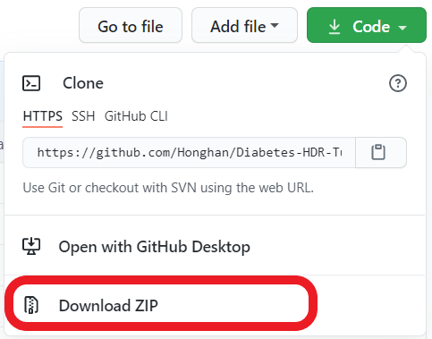
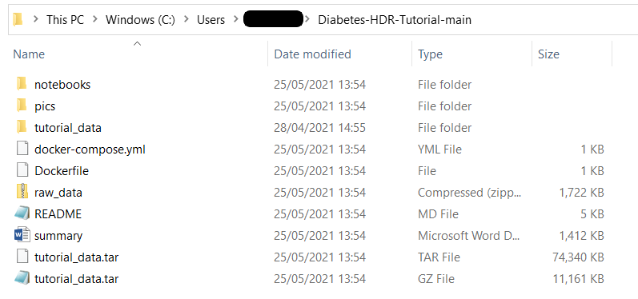

# 健康数据分析课程 - 关于糖尿病的案例研究

[Read in English](https://github.com/Honghan/Diabetes-HDR-Tutorial/blob/main/README.md)

该存储库包含用于[通用数据模型](https://www.ohdsi.org/data-standardization/the-common-data-model/)教程的所有材料。在该课程中，我们将使用1000个病人的假数据以避免在课程中使用敏感数据。

在该课程中，你会学习到关于OMOP通用数据模型的基础知识以及几种标准化术语（比如ICD-10和BNF）。你将体验将结构化数据映射到通用数据模型的过程，并且了解如何进行表型计算。

## 课程目标
- 通用数据模型（OMOP）
- 临床术语（ICD-10，药物标准：BNF）
- 表型计算（使用R和SQL）
- R的基础教程

## 环境设置
### 下载此Github存储库的zip包

请下载并存储且解压此存储库的所有文件（比如存于C盘用户名下C:\Users\your_account_name\Diabetes-HDR-Tutorial-main）。

你将会得到如下文件夹：

此存储库包含以下用于此教程的文件

- **summary.docx** 此文件提供了此课程的总结及背景介绍。*请在开始课程前浏览此文件*
- **docker-compose.yml** 你将需要此docker compose文件来设置课程所需要的环境。下面会提供详细的说明。
- **Dockerfile** 用于环境设置
- **tutorial_data.tar.gz** 此压缩包包含了数据库的数据及信息。
- **notebooks** 文件夹包含了此课程所用的R脚本。
- **raw_data.zip** 此压缩包包含了课程所用的原始数据。

### 安装Docker

为了获得此课程所需的环境，请根据你的操作系统从[这里](https://docs.docker.com/get-docker/)下载并安装Docker。

### 运行docker-compose文件
- 确保Docker正在运行
- 打开Terminal (Command Prompt).
- 将工作环境地址改为下载文件的所在地址 (比如`cd C:\Users\your_account\Diabetes-HDR-Tutorial-main`)
- 运行此代码以获取Jupyter的docker图像: `docker pull jupyter/datascience-notebook` (It might take a while)
- 运行此代码以获取Postgres的docker图像: `docker pull postgres`
- 编辑 *docker-compose.yml* 文件中的路径如下：

`    volumes:
     - C:/Users/your_account/Diabetes-HDR-Tutorial-main/notebooks:/home/jovyan/work`

`    volumes:
     - C:/Users/your_account/Diabetes-HDR-Tutorial-main/tutorial_data:/var/lib/postgresql/data/`

将冒号前的地址改为你的工作环境地址.
- 通过如下代码来运行compose文件:

`docker-compose up -d --build`
- 打开浏览器并打开 `http://localhost:8899`. 

密码是 `tutorial`. 然后你应该可以打开位于*notebooks*文件夹下的jupyter notebooks文件。

现在你可以浏览R文件并且一一运行每一个代码模块。*请注意你在载入文件包前需要安装文件包*

- 运行此代码以关闭docker containers并且移除docker network:

`docker-compose down`

### 可选：不想每次都安装R文件包？
在安装了文件包后，你可以通过此代码来保存docker image：:

`docker commit CONTAINER IMAGE:TAG`

你需要编辑Container, image, and tag.

你可以通过此代码来确认正在运行的docker containers:

`docker ps`

你可以通过此代码来获取docker images的列表：

`docker images`

### 可选：用pgadmin来读取数据库
从[这里](https://www.pgadmin.org/download/)下载*PGAdmin*来读取数据库。完成安装后，通过此设置来建立一个新的服务器（请先确保你已经运行了docker-compose文件）：
- host: localhost
- port: 5434
- username: postgres
- password: tutorial

之后你就可以连接到用于此教程的数据库啦。
