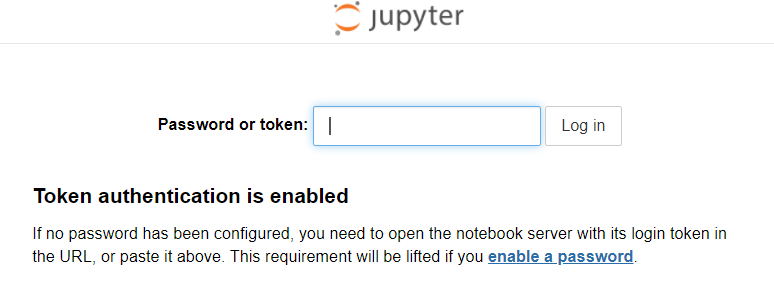
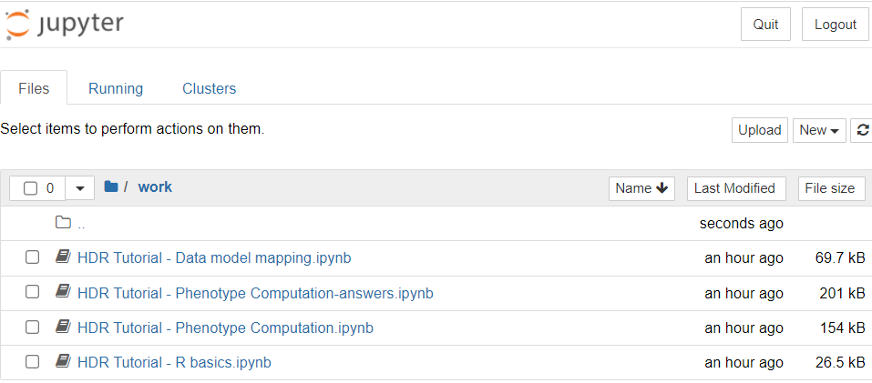

# Health Data Research Tutorial - a case study in Diabetes

[Read in Chinese中文](https://github.com/Honghan/Diabetes-HDR-Tutorial/blob/main/README.cn.md)

This repository includes all the materials you need for a hands-on [Common Data Model](https://www.ohdsi.org/data-standardization/the-common-data-model/) tutorial using a synthetic 1,000 patient records.

In this tutorial, you will learn the basics of OMOP Common Data Model and multiple standardised terminologies (ICD-10, BNF). You will go through the pipeline of mapping structured data to a Common Data Model and have an experience of carrying out phenotype computation.

## Objectives
- common data model (OMOP)
- clinical terminologies (ICD-10, Drug standards: BNF)
- phenotype computation (R and SQL)
- R tutorial

## Environment setup
### Download the zip file from this Github repository
Please download all files from this repository

and save (unzip) them to your working directory (e.g. **C:\Users\your_account_name\Diabetes-HDR-Tutorial-main**).

Then you will get a folder looks like this:

This repository includes the files you need for this tutorial

- **summary.docx** provides a brief summary and background information of this tutorial. *Please go through this document before the tutorial.*
- **docker-compose.yml** is the docker compose file you need for setting up the environment. Further instructions will be provided below.
- **Dockerfile** the file used for setting up the environment.
- **tutorial_data.tar.gz** wrapped up the files you need for the database.
- **notebooks** includes the R scripts of this tutorial.
- **raw_data.zip** includes the raw data (synthetic data) we used for this tutorial.

### Install Docker
In order to get the environment you need for this tutorial, please download and install Docker according to your operating system from [here](https://docs.docker.com/get-docker/).

### Run docker-compose file
- Make sure Docker is running.
- Open the Terminal (Command Prompt).
- Change the working directory to the path holds the files you downloaded. (e.g.`cd C:\Users\your_account\Diabetes-HDR-Tutorial-main`)
- Pull the image for Jupyter by run: `docker pull jupyter/datascience-notebook` (It might take a while)
- Pull the image for Postgres by run: `docker pull postgres`
- Edit the path in file *docker-compose.yml*

`    volumes:
     - C:/Users/your_account/Diabetes-HDR-Tutorial-main/notebooks:/home/jovyan/work`

`    volumes:
     - C:/Users/your_account/Diabetes-HDR-Tutorial-main/tutorial_data:/var/lib/postgresql/data/`

Change the path before the colon to your working directory.
- Run the compose file by:

`docker-compose up -d --build`
- Open the browser and open `http://localhost:8899`. 

The token is `tutorial`. Then you should be able to open the jupyter notebooks in the folder *notebooks*.

Now you should be able to go through the R files by running each code cell. *Please note you need to install the packages before loading them.*
- To close the containers and remove the network, stop the compose by:

`docker-compose down`

### Optional: don't wanna install those R packages everytime?
You can save a Docker image after installing the packages by:

`docker commit CONTAINER IMAGE:TAG`

Edit Container, image, and tag.

You can check the running Docker containers by

`docker ps`

You can list the Docker images by

`docker images`

### Optional: pgadmin for checking the database
You can download *PGAdmin* to have a look of the database from [here](https://www.pgadmin.org/download/). After installing, you can create a new server by this setting (make sure you run the docker-compose file first):
- host: localhost
- port: 5434
- username: postgres
- password: tutorial

Then you should be able to connect to the database we use for this tutorial.
